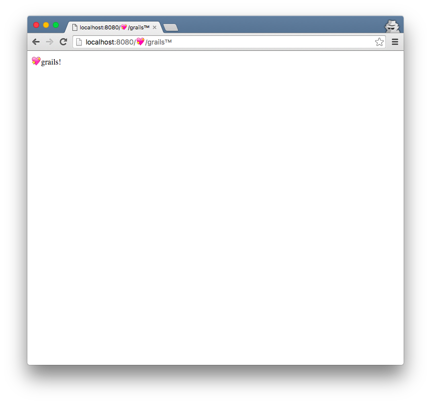

Emoji URLS
==========

A simple Grails application that uses emoji symbols as URL's fragments.

How the emoji url looks like on the status bar (and on the page content)

How the emoji url looks like on the address bar and title

See it at work on https://grails-emoji-urls.herokuapp.com/
